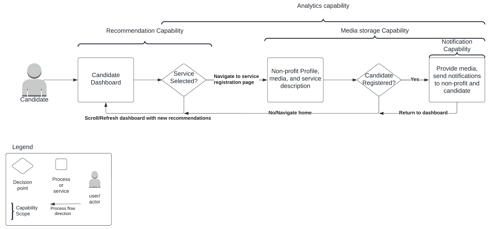
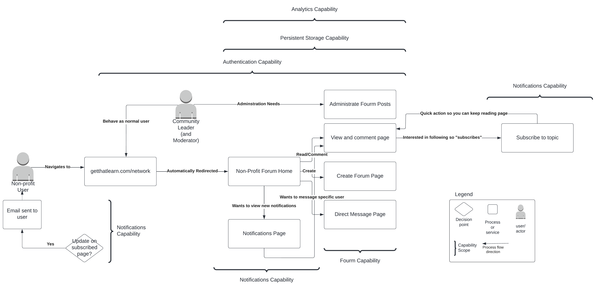
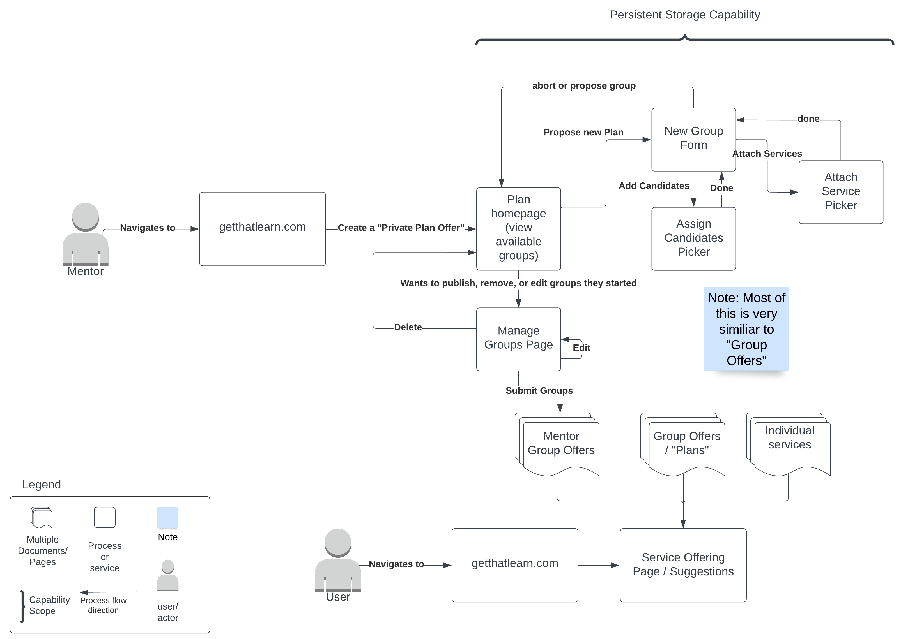

# Actors, Actions & Significant Scenarios

The following identifies the significant actors, actions and key scenarios that will inform the architecture of the Spotlight project. The enumeration of important user stories is useful to gain a overall sense for what needs to be provided by the service. Each significant scenario also point to the related technical capabilities in the proposed architecture.
   
## Actors & Actions

The identified actors their actions are as follows:

| Actor                  | Actions                                                      |
| ---------------------- | ------------------------------------------------------------ |
| Non-profit  | * Registers on the platform * Completes community profile  * Completes service capabilities assessment * add, edit, and delete their own "offerings"  * Non-profit to differentiate users in their org on the service (Administrators vs. Users, etc.) * see trends in demand / usage of services * automatically queue candidates for use if service offering backlogged * see how candidates who used their services are doing today * communicate with specific non-profits ("DMs") * communicate generically across non-profits ("Feed") * find and join "programs" that combines resources from multiple non-profits |
| Platform/system          | * Assigns community leader to non-profit * sends email to non-profit introducing community leader * Invites non-profit to monthly community meetings * Assigns career mentor to candidate * sends email to candidate|
| Candidate       | * registers on platform  * indiciate kinds of services they're interested in * browse through possible matches  * apply for services through the platform * follow "recommended paths" which combines multiple services |
| Administrator              | * see and manage all users in the system in case of technical issues or abuse * define list of services offered by the system * view operational and analytical reports  * view and understand candidate progress * track overall engagement (users, services, etc.) * "accept" proposed non-profits |
| Community leader           | * view contact information of non-profits for scheduling purposes * sets up introductory meeting within 1-2 weeks to discuss non profit service capabilities, responsibilities, & expectations  * sets up recurring meetings with non-profits  * assigns trainings to non-profit * Non-Profit is invited to monthly community meetings |
| Career Mentor          | * uploads new candidate career roadmap in platform	 * updates candidate assignment in platform to reflect career roadmap	 * introductory meeting  * recurring meetings  |

## Architecturally Significant Scenarios

The following are the most architecturally significant scenarios/flows, derived from the Actors and Actions above, which will shape the architecture of the Farmacy Family system.

### Legend
This legend defines all the symbols that are used throughout our diagrams. Each diagram has it's own legend, but this serves are a quick reference of all symbols used.

### 1 Registration 
#### 1.1 Non profit registration

#### Key Capability Links
- [Authn](./Key%20Capabilities/Core/Authentication.md)
- [PersistentStorage](./Key%20Capabilities/Core/PersistentStorage.md)

#### 1.2 Candidate registration

#### Key Capability Links
- [Authn](./Key%20Capabilities/Core/Authentication.md)
- [PersistentStorage](./Key%20Capabilities/Core/PersistentStorage.md)

### 2 Intake

#### 2.1 Non profit intake

#### Key Capability Links
- [SearchAndAssign](./Key%20Capabilities/Core/SearchAndAssign.md)
- [Notification](./Key%20Capabilities/Core/Notification.md)
- [Schedule](./Key%20Capabilities/Core/Schedule.md)

#### 2.2 Candidate intake

#### Key Capability Links
- [SearchAndAssign](./Key%20Capabilities/Core/SearchAndAssign.md)
- [Notification](./Key%20Capabilities/Core/Notification.md)
- [Schedule](./Key%20Capabilities/Core/Schedule.md)

### 3 Analytics

#### Key Capability Links
- [PersistentStorage](./Key%20Capabilities/Core/PersistentStorage.md)

### 4 Candidate Services

#### Key Capability Links
- [Analytics](./Key%20Capabilities/Core/Analytics.md)
- [Recommendation](./Key%20Capabilities/Core/Recommendation.md)
- [MediaStorage](./Key%20Capabilities/Core/MultimediaStorage.md)
- [Notification](./Key%20Capabilities/Core/Notification.md)

### 5 Non-profit social networking aspect

#### Key Capability Links
- [Analytics](./Key%20Capabilities/Core/Analytics.md)
- [PersistentStorage](./Key%20Capabilities/Core/PersistentStorage.md)
- [Forum](./Key%20Capabilities/Core/Forum.md)
- [Notification](./Key%20Capabilities/Core/Notification.md)
- [Authentication](./Key%20Capabilities/Core/Authentication.md)

### 5b Non-profit join programs

find and join "programs" that combines resources from multiple non-profits

#### Key Capability Links
- [PersistentStorage](./Key%20Capabilities/Core/PersistentStorage.md)
- [Notification](./Key%20Capabilities/Core/Notification.md)

### 6 training and career roadmap
#### 6.1 Platform Role based training is assigned to new Non-Profit

#### Key Capability Links
- [MultimediaStorage](./Key%20Capabilities/Core/MultimediaStorage.md)
- [PersistentStorage](./Key%20Capabilities/Core/PersistentStorage.md)
- [Notification](./Key%20Capabilities/Core/Notification.md)

#### 6.2 Career mentor uploads new candidate career roadmap in platform	

#### Key Capability Links
- [PersistentStorage](./Key%20Capabilities/Core/PersistentStorage.md)

[Previous Page](./Solution/Strategy.md) | [Next Page](./Solution/ArchAnalysis.md)
