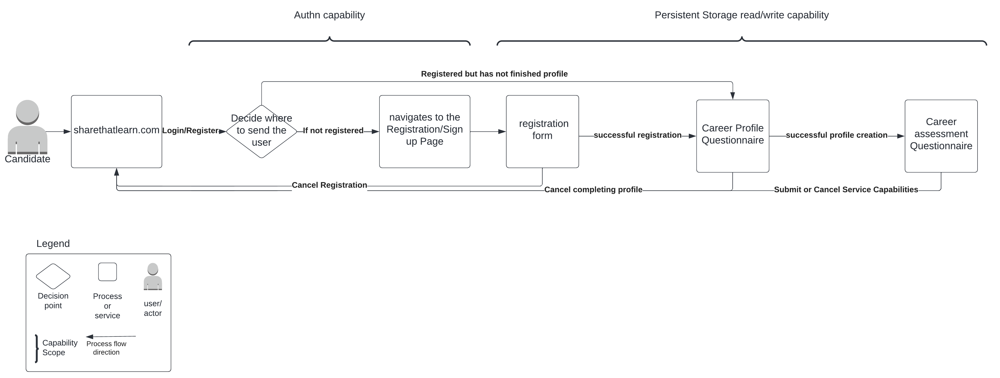

# Actors, Actions & Significant Scenarios

The Actors on the system (typically the human users but can also include other systems) and the actions they take help to form the key scenarios, or flows, of the system. The following identifies the significant actors, actions and key scenarios that will inform the architecture of the Farmacy Family system.

## Actors & Actions

The identified actors their actions are as follows:

| Actor                  | Actions                                                      |
| ---------------------- | ------------------------------------------------------------ |
| Non-profit  | * Registers on the platform * Completes community profile  * Completes service capabilities assessment * add, edit, and delete their own "offerings"  * Non-profit to differentiate users in their org on the service (Administrators vs. Users, etc.) * see trends in demand / usage of services * automatically queue candidates for use if service offering backlogged * see how candidates who used their services are doing today * communicate with specific non-profits ("DMs") * communicate generically across non-profits ("Feed") * find and join "programs" that combines resources from multiple non-profits |
| Platform/system          | * Assigns community leader to non-profit * sends email to non-profit introducing community leader * Invites non-profit to monthly community meetings * Assigns career mentor to candidate * sends email to candidate|
| Candidate       | * registers on platform  * indiciate kinds of services they're interested in * browse through possible matches  * apply for services through the platform * follow "recommended paths" which combines multiple services |
| Administrator              | * see and manage all users in the system in case of technical issues or abuse * define list of services offered by the system * view operational and analytical reports  * view and understand candidate progress * track overall engagement (users, services, etc.) * "accept" proposed non-profits |
| Community leader           | * view contact information of non-profits for scheduling purposes * sets up introductory meeting within 1-2 weeks to discuss non profit service capabilities, responsibilities, & expectations  * sets up recurring meetings with non-profits  * assigns trainings to non-profit * Non-Profit is invited to monthly community meetings |
| Career Mentor          | * uploads new candidate career roadmap in platform	 * updates candidate assignment in platform to reflect career roadmap	 * introductory meeting  * recurring meetings  |

## Architecturally Significant Scenarios

The following are the most architecturally significant scenarios/flows, derived from the Actors and Actions above, which will shape the architecture of the Farmacy Family system.

### 01 Registration 
#### 01 Non profit registration
Step 1-3 from Operational Process - Registration & Intake (Non-Profit) (Non-Profit and )
(combine a high level technical with process details)

#### 02 Candidate registration

### 02 Intake
Step 4-7 from Operational Process - Registration & Intake (Non-Profit)
A non-profit with offering registers on the platform
#### 01 Non profit intake
Step 1-3 from Operational Process - Registration & Intake (Non-Profit) (Non-Profit and )
(combine a high level technical with process details)
#### 02 Candidate intake

### 03 Analytics
Tracking engagement
Tracking candidate progress
non-profit see trends in demand / usage of services
Actor - administrator, career mentor

### 04 Candidate Services
(Browsing services, service catalog, roadmap, progress?)

### 05 Non-profit social networking aspect
communicate with specific non-profits ("DMs")
communicate generically across non-profits ("Feed")

### 05b Non-profit join programs

find and join "programs" that combines resources from multiple non-profits

### 06 training and career roadmap
Platform Role based training is assigned to new Non-Profit
Career mentor uploads new candidate career roadmap in platform	

## Assumptions/Questions
1. Career Mentor role is serviced by non-profit to ensure mentor's commitment to the cause and vetting of mentor by non-profit.
2. Community leader is from the spotlight app/platform employee/volunteer.
3. Taking the responsibility of scheduling meetings and assignments away from system/platform and giving it to community leaders and career mentors lowers the complexity of scheduling meetings between specific attendees.

Dont know what to do about these yet:
Incentivize engagement????
spotlight non-profit
highlight feeds (?)
