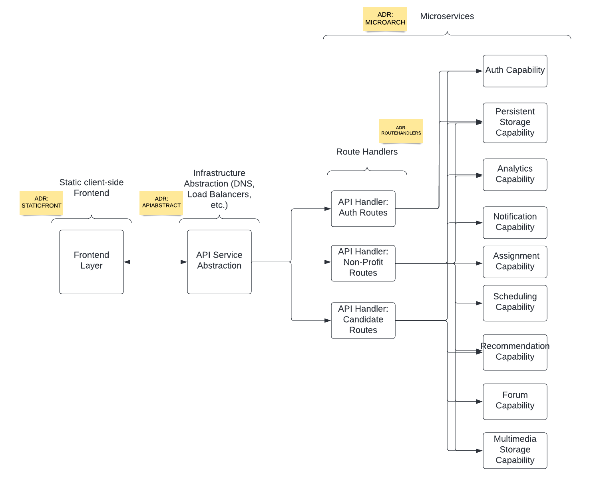

# General Architecture

The general architecture brings together the [Architecture Analysis](./Solution/ArchAnalysis.md), incorporating the key characteristics of the application architecture. As depicted in the diagram, the application is divided into 4 major components that are loosely coupled.

#### Client-side Frontend
This is the GUI layer that gets deployed separately and depends upon API request/responses from backend services to support CRUD activities performed from the GUI

#### Infrastructure-based abstraction layer
This layer acts as a separation between APIs and their implementation by configuring DNS entries and managing load-balancers to provide secure network connections

#### Route Handlers
This layers is comprised of a set of services to implement the business use cases and configure routes accordingly. This decouples the routing logic further from the actual backend APIs, allowing easier extensibility

#### Backend microservices
These are divided into core capabilities, which will provide services for the business use cases defined in route handlers

[Previous Page](https://github.com/TheMarmots/ArchKatas2022/blob/main/Solution/ArchAnalysis.md) | [Next Page](https://github.com/TheMarmots/ArchKatas2022/blob/main/Solution/DetailedArch.md)
