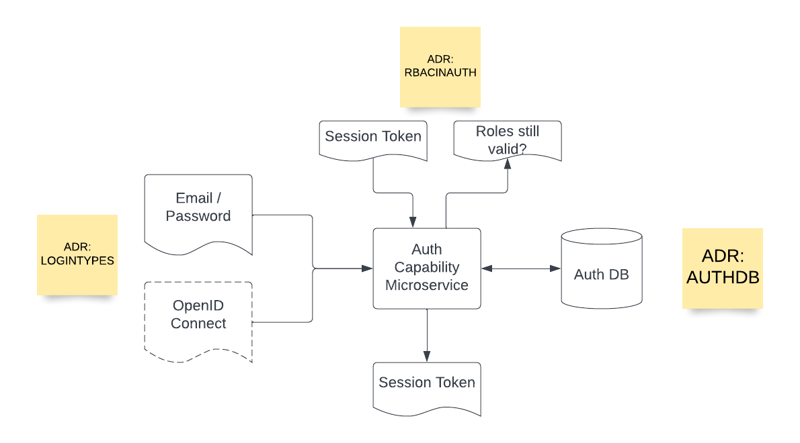

# Authentication Capability

## Diagram

## Description

The Auth capability is broadly responsible for handling user auth (handling login/logout, password reset, etc) as well as internal service support (RBAC).

## Use Cases

* Registration
* Login
* Internal Service RBAC
* Session Token Generation
## Components

* Auth DB: Used for storing user info, session token metadata, and roles.

## Architectural Characteristics
