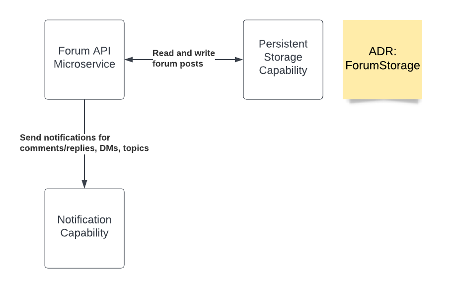

# Forum Capability

## Diagram

## Description
The forum capability provides a place for candidates to discuss, ask questions, and collaborate with other candidates. It also provides an opportunity for non-profits to interact with their students asynchronously about offerings and any feedback they might have.

## Use Cases
- Ask engage in discussions and collaborate with other candidates about specific offerings.
- Ask questions and provide feedback to non-profits regarding specific offerings.
- Have direct message conversations with offering providers and mentors

## Components
- Forum API microservice
- Persistent Storage Capability
- Notification Capability

## Architectural Characteristics
- High Availability
- Eventual Consistency for data storage
