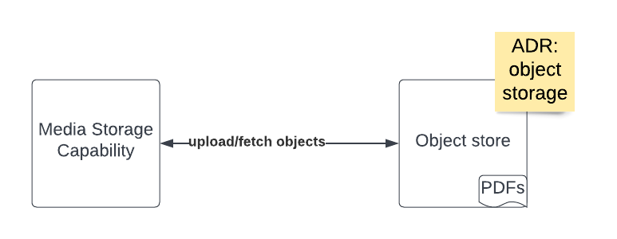

# Multimedia Storage Capability

## Diagram

## Description
The multimedia storage capability is broadly responsible for handling downloadable readable content of an offering. 

## Use Cases
* Upload resources
* Download/fetch resources
* Handling errors

## Components
* Multimedia Storage Capability: Logic to communicate with object store, handle upload and download/fetch requests
* Object storage: An object store for readable content in the form of pdfs.

## Architectural Characteristics
* Low cost
* Availability
