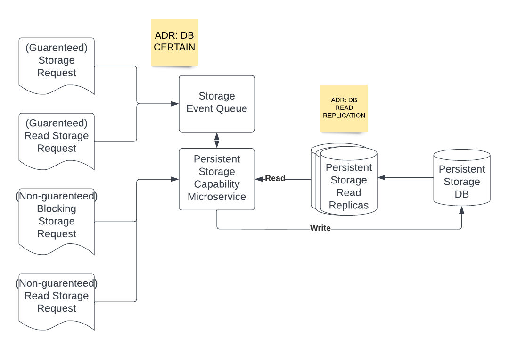

# Persistent Storage Capability

## Diagram

## Description

The persistence capability is used for allowing other services to store persistent data in shared ways. This will be used by many other capabilities to store and share data without having to reimplement the same logic.
## Use Cases
* Guarenteed data storage (without blocking): Allow services to submit data to be stored even if parts of the persistence service are down. Uses a queue interface.
* Guarenteed data read (without blocking): Allow services to read data even if parts of the persistence service are down. Uses a queue interface.
* "Fast" read / write: Allows services to write and read to the databse. Assuming the service is up, this will return only when the write completes. If the service is down, notifies the client and makes them decide how to handle the unavailability.

## Components
* Storage Event Queue: Event-driven bus for queuing read and write requests.
* Persistent Storage Capability Microservice: Primary logic used by routes and other microservices. Can be interfaced with both using some RESTful style (for the non-guarenteed read/writes) and using a queue interface (for the guarenteed read/writes).
* Persistent Storage DB: Primary database representing the "official" state of data.
* Persistence Storage Read Replicas: Replicas used for speeding up reads.

## Architectural Characteristics
* Eventual Consistency
* High Availability