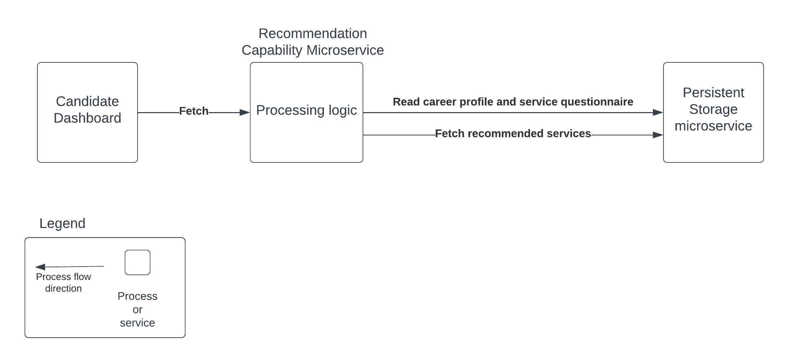

# Recommendation Capability

## Diagram

## Description
The recommendation capability is responsible for handling service recommendations.

## Use Cases
* Recommend service offerings to candidates based on the candidate profile, career assessment and service interests.

## Components
* Recommendation Microservice: This component consumes the auth token to get the user information. It contains primary logic for reading the candidate's career profile, career assessment and service interest information from the persistent storage microservice. After that information is fetched it will run text/string search based on simple keywords and candidate's service interests to fetch a list of recommended services (from multiple non-profits) from the persistent storage microservice. The recommendation analysis is kicked off by a fetch request from the candidate dashboard and the set of recommendations is displayed there for the user.

## Architectural Characteristics
* Interoperability
* Extensibility 
