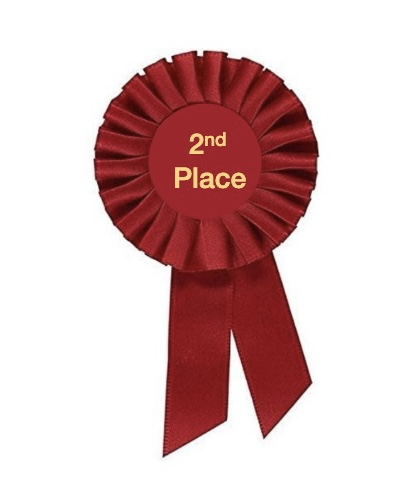
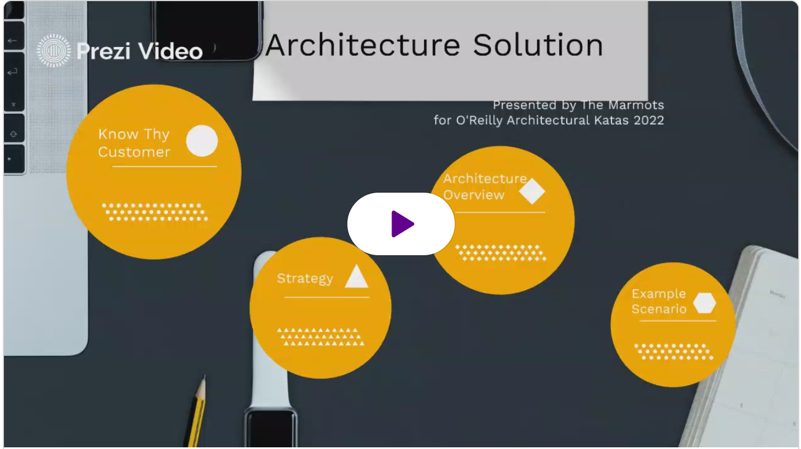

# Architectural Kata: Summer 2022: Spotlight App

## Introduction
Welcome to our solution repository for the O'Reilly Summer 2022 Architectural Kata. The repository holds our thought process behind the solution for the Kata - Spotlight App - and propose an architecture satisfying Spotlight's goals.									
## Members

Josiah Bruner, Kevin Basista, Gagan Rajput, Sneha Kokil

## Problem Analysis

* [Problem Background](./ProblemAnalysis/Background.md)
* [Business Drivers and Goals](./ProblemAnalysis/DriversGoals.md)
* [Business Requirements](./ProblemAnalysis/BusinessReqs.md)

## Solution
* [Our Strategy](./Solution/Strategy.md)
* [Actors, Actions, and Significant Scenarios](./Actors,%20Actions%20&%20Significant%20Scenarios.md)
* [Architecture Analysis](./Solution/ArchAnalysis.md)
* [High-level Architecture](./GeneralArchitecture.md)
* [Detailed Architecture](./Solution/DetailedArch.md)
* [User-facing Workflows](./ExampleMocks.md)
* [Architectural Decision Records (ADRs)](./ADRs)

## Future Roadmap
The future enhancements in Spotlight's architecture are based upon the long-term business requirements and evolvability of the application.

* Enhance the search/match functionality to enable automated offerings suggestions to candidates
* Increase the number of ways to collaborate by adding group-sharing capabilities
* Enhance intelligence and accuracy of search/match functionality using AI models
* Allow non-profits to add samples/trials of their services

## Finals Video Presentation

