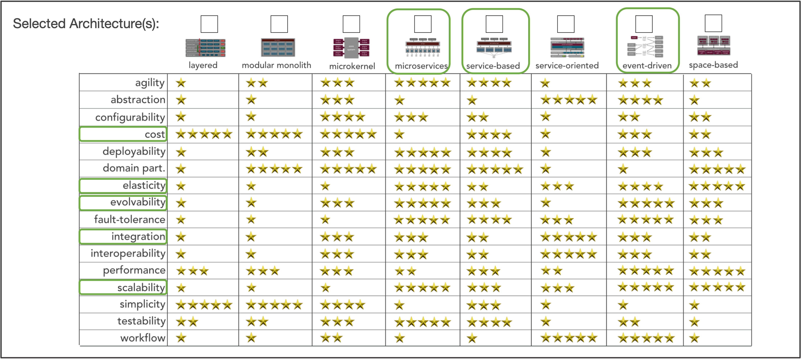

# Architecture Analysis

## Key Non-functional Properties
In this section we describe the key non-functional properties of the architecture.

#### Scalability
We did a bit of research to ballpark our possible market in the future.

~1.54 million nonprofits registered with IRS in 2016: https://nccs.urban.org/project/nonprofit-sector-brief

Very hard to find data on how many people take advantage of non-profits. As a high bound, let's say 25% of the US takes advantage per year: ~82.375 million

Comparsison: LinkedIn has ~830 million users across 200 countries: https://about.linkedin.com/

So our scale is roughly one order of magnitude smaller than LinkedIn. This is still *very large* and the architecture proposed needs to be able to scale to this size.
#### Extensibility and Evolvability

Non-profits operate in a huge number of different causes and may collaborate in a near infinite number of ways. Although our initial design will support only a subset of these possibilities, it's clear that the platform needs to be extensible enough to support the growing number of non-profits and their needs.

#### Usability

We must be cognizant that both non-profits and candidate users may have very limited experience in technology. As such, our architecture focuses significantlly on ease-of-use and the ability for quick iteration and rapid prototyping. This will help UX and engineering teams to spend more time understanding user needs.

## Additional Considerations
#### Elasticity
Given the increasing amount of data and records that the applcation would have to maintain, we needed the application resources to be expandable to meet the changing needs, without affecting operations.

#### Integration
The Spotlight application brings together many non-profits and their services. This may involve integrating with the external APIs to provide seamless function. 

#### Cost-effectiveness
The application is developed and maintained by a non-profit organization, funding for which may be limited and has to be used in an effective manner. For this reason, we also factored in relative cost of using a particular architecture style.

## Architecture Styles
Using the analsys of the key non-functional properties above and with the help of  the [worksheet](https://www.developertoarchitect.com/downloads/architecture-styles-worksheet.pdf), we compared a few styles and finalized one that will give us the most benefits with respect to the non-functional properties above. 

As shown in the table, Microservices, Service-based and event-based architectures were the most suitable candidates. We selected Microservices to be the architectural style for this application, because of the following reasons:

1. Microservices style checked most boxes for non-functional requirements with higher number of ratings than the others.
2. Service-based style was a close second, but it lacked in key aspects such as scalability.
3. Event-driven style was not entirely applicable for Spotlight's use cases.

The detailed choice of Microservices architecture is documented in [ADR: MICROARCH](./../ADRs/MICROARCH.md).